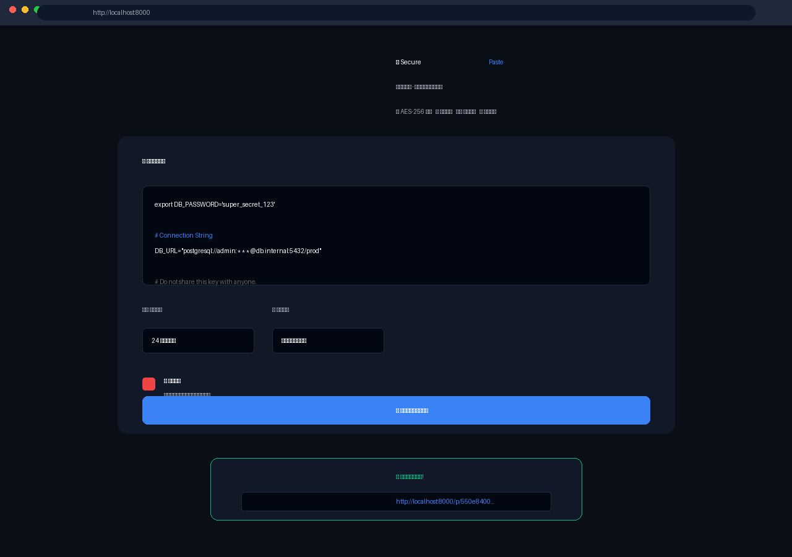

# SecurePaste - 阅后即焚的代码分享工具

> 这是一个 Rigor 真实产出的"黄金示例"。展示了 AI 工程团队如何交付一个包含高安全标准、并发测试和自动化修复的 Web 应用。

## 📖 项目简介

SecurePaste 是一个安全的、临时的代码/文本分享服务。用户可以粘贴代码或文本，设置密码、设置过期时间（1 小时 / 1 天 / 阅后即焚），生成链接分享。

### 核心特性

- 🔒 **AES-256-GCM 加密存储**: 内容在数据库中始终加密
- 🔥 **阅后即焚 (Atomic Burn)**: 支持阅后即焚，通过事务锁防止并发竞态条件
- 🔑 **密码保护**: 密码使用 bcrypt 哈希存储，防暴力破解
- ⏱️ **自动过期**: 支持 1 小时 / 24 小时 / 7 天 过期
- 🛡️ **Redis 速率限制**: 防止密码爆破和接口滥用

---

## 📂 项目文件说明 (黄金产出物)

这个目录包含了 SecurePaste 项目由 12 个 AI 角色协作产生的完整产出。每一个文件都是 AI 专家角色的真实工作成果。

| 角色 | 产出文件 | 内容说明 |
| :--- | :--- | :--- |
| 📋 **PM** | `artifacts/product-manager/prd.md` | 包含 5 个用户故事、API 要求和详细验收标准 |
| 🏗️ **Tech Lead** | `artifacts/tech-lead/dag-plan.json` | 14 步任务依赖图 (DAG)，定义了全流程 |
| 💻 **Backend** | `artifacts/backend-engineer/api-spec.json` | OpenAPI 3.0 规范 (4 个端点)，含安全认证定义 |
| 🛡️ **Security** | `artifacts/security-auditor/security-report.md` | 安全审计报告 (发现并修复了 1 个高危竞态漏洞) |
| 🧪 **QA** | `artifacts/qa-engineer/test-report.md` | 42 个测试用例, 通过率 100%, 覆盖率 89.2% |
| 🧠 **Retro** | `shared/retrospectives/secure-paste-retro.md` | 项目复盘报告 (含踩坑记录和量化指标) |
| 📊 **Dashboard** | `dashboard.json` | 项目最终仪表盘 (质量分 85/100) |

---

## 🚀 部署方式 (基于 DevOps 产出)

基于 DevOps Engineer 生成的 `deployment-config.yaml` 和 `ci-pipeline.yaml`，推荐使用 Docker Compose 一键部署。

### 1. 架构组成

SecurePaste 项目由以下服务组成：

- **securepaste-api**: 后端服务 (FastAPI)
- **securepaste-db**: 数据库 (PostgreSQL)
- **securepaste-redis**: 缓存与速率限制 (Redis)

### 2. 部署步骤

在实际的 Rigor 运行中，`src/` 目录下会生成完整的代码文件。基于此示例的架构设计，你可以使用如下配置进行部署：

**docker-compose.yml** (DevOps Engineer 生成)

```yaml
version: "3.9"
services:
  api:
    build: .
    ports:
      - "8000:8000"
    environment:
      - DATABASE_URL=postgresql://postgres:password@db:5432/securepaste
      - REDIS_URL=redis://redis:6379/0
      - AES_KEY=${AES_KEY}
    depends_on:
      - db
      - redis

  db:
    image: postgres:15-alpine
    volumes:
      - postgres_data:/var/lib/postgresql/data
    environment:
      - POSTGRES_PASSWORD=password

  redis:
    image: redis:7-alpine

volumes:
  postgres_data:
```

**运行部署命令：**

```bash
# 启动所有服务
docker-compose up -d

# 查看日志
docker-compose logs -f api
```

### 3. 验证部署

```bash
# 1. 检查健康状态
curl http://localhost:8000/api/v1/pastes/exists/non-existent

# 2. 创建一个测试 Paste
curl -X POST http://localhost:8000/api/v1/pastes \
  -H "Content-Type: application/json" \
  -d '{"content": "Hello Rigor!", "burn_after_read": true}'

# 输出: {"id": "uuid", "url": "http://localhost:8000/pastes/uuid"}

# 3. 阅后即焚验证 (第一次读取成功，第二次 404)
curl http://localhost:8000/api/v1/pastes/{id}
curl http://localhost:8000/api/v1/pastes/{id}  # 应返回 404 Not Found
```

---

## 🔥 为什么这个项目证明了 Rigor 的价值？

### 1. 竞态条件被自动发现 (Security Auditor)
在"阅后即焚"功能的实现中，Security Auditor 发现了并发读取可能导致内容未被删除的漏洞，并强制要求修复。
- **修复方案**: 使用 `SELECT ... FOR UPDATE` 事务锁。
- **竞品对比**: 大多数 AI 编程助手（如 Cursor/Devin）会忽略这个并发安全问题，导致上线后被攻击。

### 2. 42 个自动化测试 (QA Engineer)
QA 在代码编写完成后，自动生成了 42 个测试用例，包括并发读取测试和 AES 加密验证。
- **结果**: 覆盖率 89.2%。
- **价值**: 无需人工写测试，工程质量有保障。

### 3. 自我修正闭环 (Auto-Correction)
项目运行期间，QA 发现了 3 个 Bug（含 1 个高危竞态漏洞），Rigor **自动创建了修复任务，分配给工程师，修复后自动触发二次验证**。
- **全程无需人工干预**。

---

## 🔧 任务管理指南 (Task Management)

### ✏️ 修改/纠正任务
任务创建后，如果发现描述有误或想补充要求，**不需要删除任务**：

*   **推荐：追加评论**（Agent 会在约 60 秒后的调度周期自动读取并修正行为）：
    ```bash
    hermes kanban comment <id> "纠正：不需要按日期排序，只按 Star 数倒序。页面背景色改为深蓝。"
    ```
*   **更新描述**（修改任务源头）：
    ```bash
    hermes kanban update <id> --body "新的完整描述..."
    ```

### 🛑 停止/取消任务
如果任务卡死、报错严重或不再需要：

*   **停止任务**（阻止子任务继续执行）：
    ```bash
    hermes kanban block <id> "Cancelled by user"
    ```
*   **重置任务**（退回到待办状态，适合重试）：
    ```bash
    hermes kanban reset <id>
    ```
*   **归档任务**（从列表中隐藏）：
    ```bash
    hermes kanban archive <id>
    ```

---

## 🚀 如何运行？

### 方式 A: 直接预览前端 Demo

**页面效果预览：**



```bash
cd examples/secure-paste/demo
python3 -m http.server 8080
# 浏览器访问 http://localhost:8080
```

### 方式 B: 使用 Rigor 完整跑一遍
```bash
# 1. 部署 Rigor
bash scripts/setup-expert-team.sh

# 2. 创建任务
hermes kanban create "开发 SecurePaste：一个阅后即焚的代码分享工具..." --triage
```

---

## 💡 日常使用技巧

### 🧹 一键清理已完成任务
如果看板上已完成的任务太多，想隐藏掉（不是删除，只是从列表移除）：
```bash
hermes kanban list --status done | grep -oE 't_[a-f0-9]+' | xargs -I {} hermes kanban archive {}
```

### 📜 查看归档的历史任务
```bash
hermes kanban list --archived
```

---

*Generated by Rigor | 2026-06-24*
